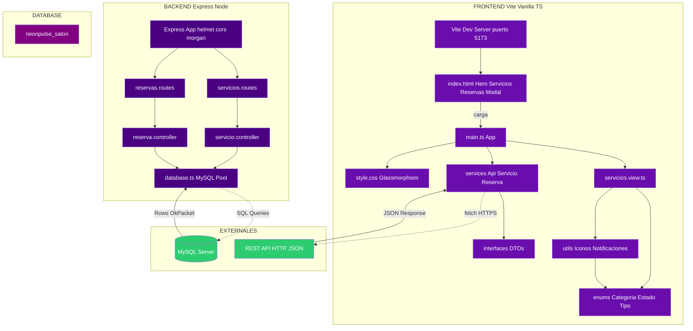

# Diagrama de Componentes (Arquitectura)

## Stack Tecnológico

| Capa | Tecnología |
|---|---|
| **Frontend** | TypeScript 6.0, Vite 8, Vanilla JS, Fetch API, DOM API |
| **Backend** | Node.js, Express 5, TypeScript 4.9, mysql2/promise |
| **Database** | MySQL 8.0 (alwaysdata) |
| **DevOps** | nodemon, ts-node, dotenv |
| **Seguridad** | helmet, cors, dotenv |
| **Logging** | morgan |
