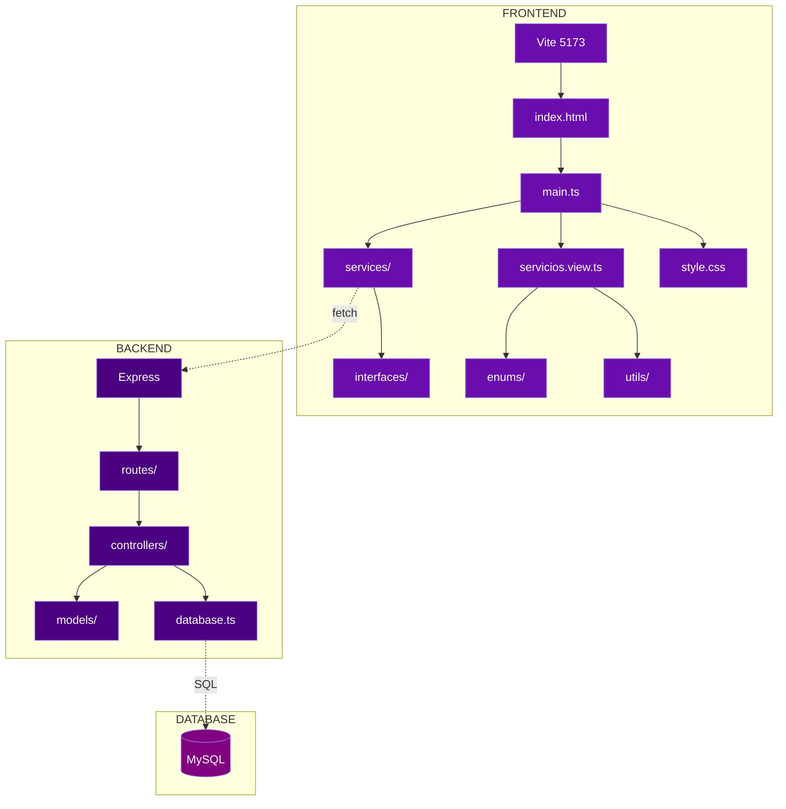

# Diagrama de Componentes (Arquitectura)

```mermaid
graph TD
    subgraph "FRONTEND"
        direction TB
        FE_VITE[Vite 5173]
        FE_HTML[index.html]
        FE_MAIN[main.ts]
        FE_VIEW[servicios.view.ts]
        FE_SVC[services/]
        FE_INT[interfaces/]
        FE_ENUMS[enums/]
        FE_UTILS[utils/]
        FE_CSS[style.css]

        FE_VITE --> FE_HTML
        FE_HTML --> FE_MAIN
        FE_MAIN --> FE_VIEW
        FE_MAIN --> FE_SVC
        FE_SVC --> FE_INT
        FE_VIEW --> FE_ENUMS
        FE_VIEW --> FE_UTILS
        FE_MAIN --> FE_CSS
    end

    subgraph "BACKEND"
        direction TB
        BE_APP[Express]
        BE_ROUTES[routes/]
        BE_CTRL[controllers/]
        BE_MODEL[models/]
        BE_DB[database.ts]

        BE_APP --> BE_ROUTES
        BE_ROUTES --> BE_CTRL
        BE_CTRL --> BE_MODEL
        BE_CTRL --> BE_DB
    end

    subgraph "DATABASE"
        DB[(MySQL)]
    end

    FE_SVC -.->|fetch| BE_APP
    BE_DB -.->|SQL| DB

    classDef frontend fill:#6a0dad,color:#fff
    classDef backend fill:#4b0082,color:#fff
    classDef database fill:#800080,color:#fff

    class FE_VITE,FE_HTML,FE_MAIN,FE_VIEW,FE_SVC,FE_INT,FE_ENUMS,FE_UTILS,FE_CSS frontend
    class BE_APP,BE_ROUTES,BE_CTRL,BE_MODEL,BE_DB backend
    class DB database
```