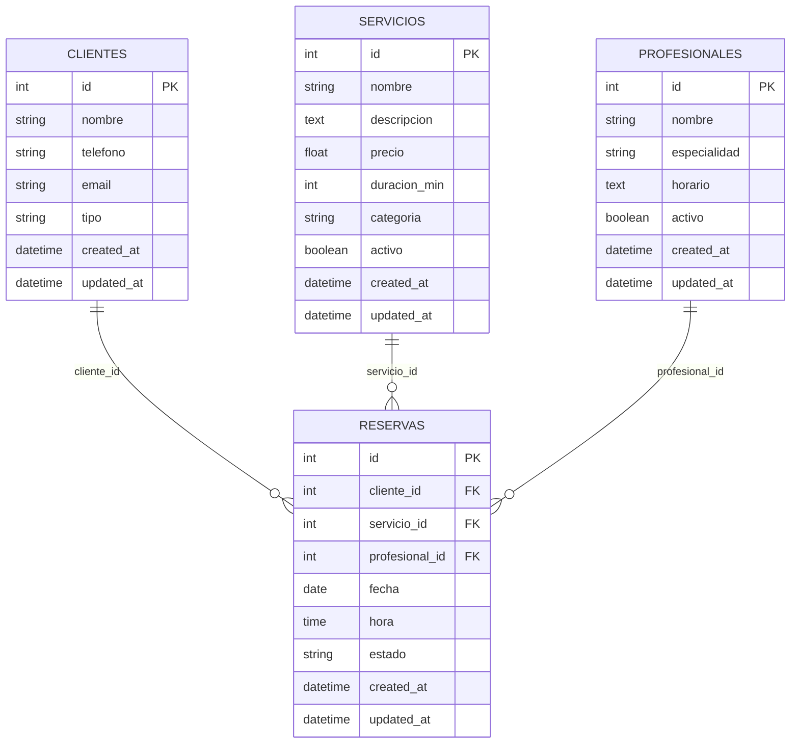

# Diagrama Entidad-Relación (MySQL)

## Descripción

| Tabla | Descripción |
|---|---|
| **servicios** | Catálogo de servicios |
| **profesionales** | Personal y especialidad |
| **clientes** | Clientes registrados |
| **reservas** | Reservas de citas |

## Restricciones
- `email` en clientes es UNIQUE
- `cliente_id`, `servicio_id`, `profesional_id` en reservas son FK RESTRICT
- `unique_reserva (profesional_id, fecha, hora)` previene dobles reservas