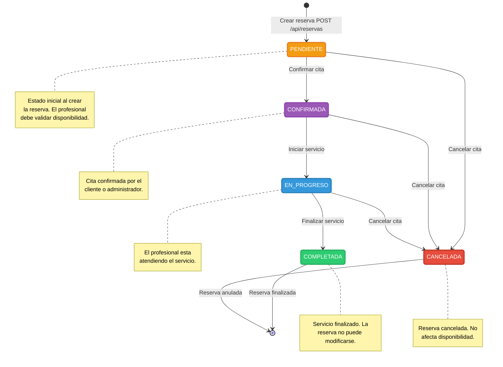

# Diagrama de Estados (Reserva)

## Valores del Enum EstadoReserva

| Estado | Color UI | Descripción |
|---|---|---|
| `PENDIENTE` | Naranja | Reserva creada pero no confirmada |
| `CONFIRMADA` | Púrpura | Cita confirmada |
| `EN_PROGRESO` | Azul | Servicio en ejecución |
| `COMPLETADA` | Verde | Servicio finalizado |
| `CANCELADA` | Rojo | Reserva anulada |