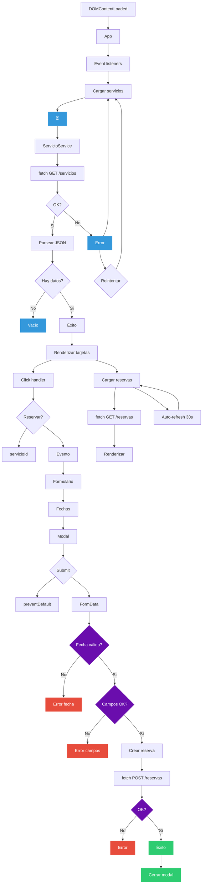

# Diagrama de Flujo (Frontend)

```mermaid
flowchart TD
    A[DOMContentLoaded] --> B[App]
    B --> C[Event listeners]
    C --> D[Cargar servicios]

    D --> D1[⏳]
    D1 --> D2[ServicioService]
    D2 --> D3[fetch GET /servicios]

    D3 --> E{OK?}
    E -->|No| F[Error]
    F --> D

    E -->|Si| G[Parsear JSON]
    G --> H{Hay datos?}
    H -->|No| I[Vacío]
    H -->|Si| J[Éxito]
    J --> K[Renderizar tarjetas]
    K --> L[Click handler]

    L --> M{Reservar?}
    M --> N[servicioId]
    M --> O[Evento]
    O --> P[Formulario]

    P --> Q[Fechas]
    Q --> R[Modal]

    R --> S{Submit}
    S --> T[preventDefault]
    S --> U[FormData]
    U --> V{Fecha válida?}
    V -->|No| W[Error fecha]
    V -->|Sí| Y{Campos OK?}
    Y -->|No| Z[Error campos]
    Y -->|Sí| AA[Crear reserva]

    AA --> AB[fetch POST /reservas]
    AB --> AC{OK?}
    AC -->|No| AD[Error]
    AC -->|Sí| AE[Éxito]
    AE --> AF[Cerrar modal]

    K --> AG[Cargar reservas]
    AG --> AH[fetch GET /reservas]
    AH --> AI[Renderizar]

    AG --> AJ[Auto-refresh 30s]
    AJ --> AG

    F --> AK{Reintentar}
    AK --> D

    classDef success fill:#2ecc71,stroke:#fff,color:#fff
    classDef error fill:#e74c3c,stroke:#fff,color:#fff
    classDef loading fill:#3498db,stroke:#fff,color:#fff
    classDef info fill:#6a0dad,stroke:#fff,color:#fff

    class W,Z,AD error
    class AE,AF success
    class D1,F,I loading
    class V,Y,AC info
```