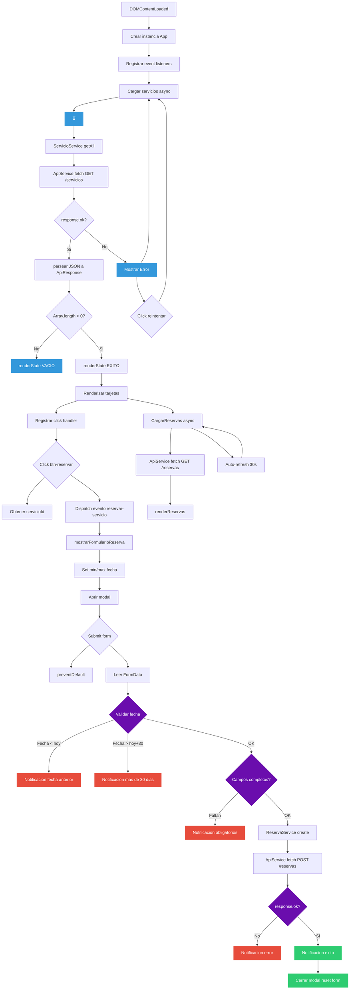

# Diagrama de Flujo (Frontend)

```mermaid
flowchart TD
    A[DOMContentLoaded] --> B[Crear instancia App]
    B --> C[Registrar event listeners]
    C --> D[Cargar servicios async]

    D --> D1[⏳]
    D1 --> D2[ServicioService getAll]
    D2 --> D3[ApiService fetch GET /servicios]

    D3 --> E{response.ok?}
    E -->|No| F[Mostrar Error]
    F --> D

    E -->|Si| G[parsear JSON a ApiResponse]
    G --> H{Array.length > 0?}
    H -->|No| I[renderState VACIO]
    H -->|Si| J[renderState EXITO]
    J --> K[Renderizar tarjetas]
    K --> L[Registrar click handler]

    L --> M{Click btn-reservar}
    M --> N[Obtener servicioId]
    M --> O[Dispatch evento reservar-servicio]
    O --> P[mostrarFormularioReserva]

    P --> Q[Set min/max fecha]
    Q --> R[Abrir modal]

    R --> S{Submit form}
    S --> T[preventDefault]
    S --> U[Leer FormData]
    U --> V{Validar fecha}
    V -->|Fecha < hoy| W[Notificacion fecha anterior]
    V -->|"Fecha > hoy+30"| X[Notificacion mas de 30 dias]
    V -->|OK| Y{Campos completos?}
    Y -->|Faltan| Z[Notificacion obligatorios]
    Y -->|OK| AA[ReservaService create]

    AA --> AB[ApiService fetch POST /reservas]
    AB --> AC{"response.ok?"}
    AC -->|No| AD[Notificacion error]
    AC -->|Si| AE[Notificacion exito]
    AE --> AF[Cerrar modal reset form]

    K --> AG[CargarReservas async]
    AG --> AH[ApiService fetch GET /reservas]
    AH --> AI[renderReservas]

    AG --> AJ[Auto-refresh 30s]
    AJ --> AG

    F --> AK{Click reintentar}
    AK --> D

    classDef success fill:#2ecc71,stroke:#fff,color:#fff
    classDef error fill:#e74c3c,stroke:#fff,color:#fff
    classDef loading fill:#3498db,stroke:#fff,color:#fff
    classDef warning fill:#f39c12,stroke:#fff,color:#fff
    classDef info fill:#6a0dad,stroke:#fff,color:#fff

    class W,X,Z,AD error
    class AE,AF success
    class D1,F,I loading
    class V,Y,AC info
```