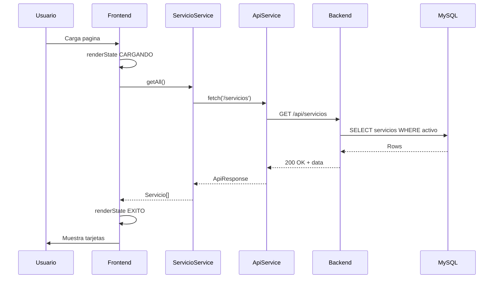
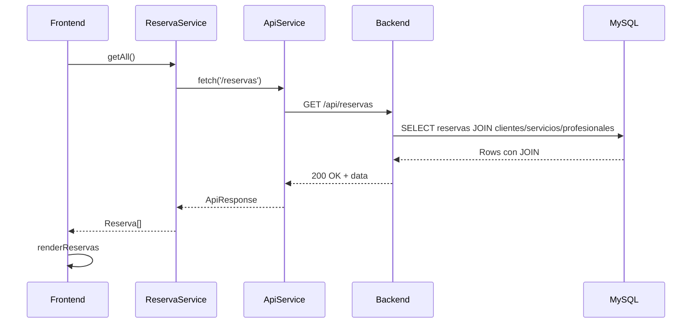
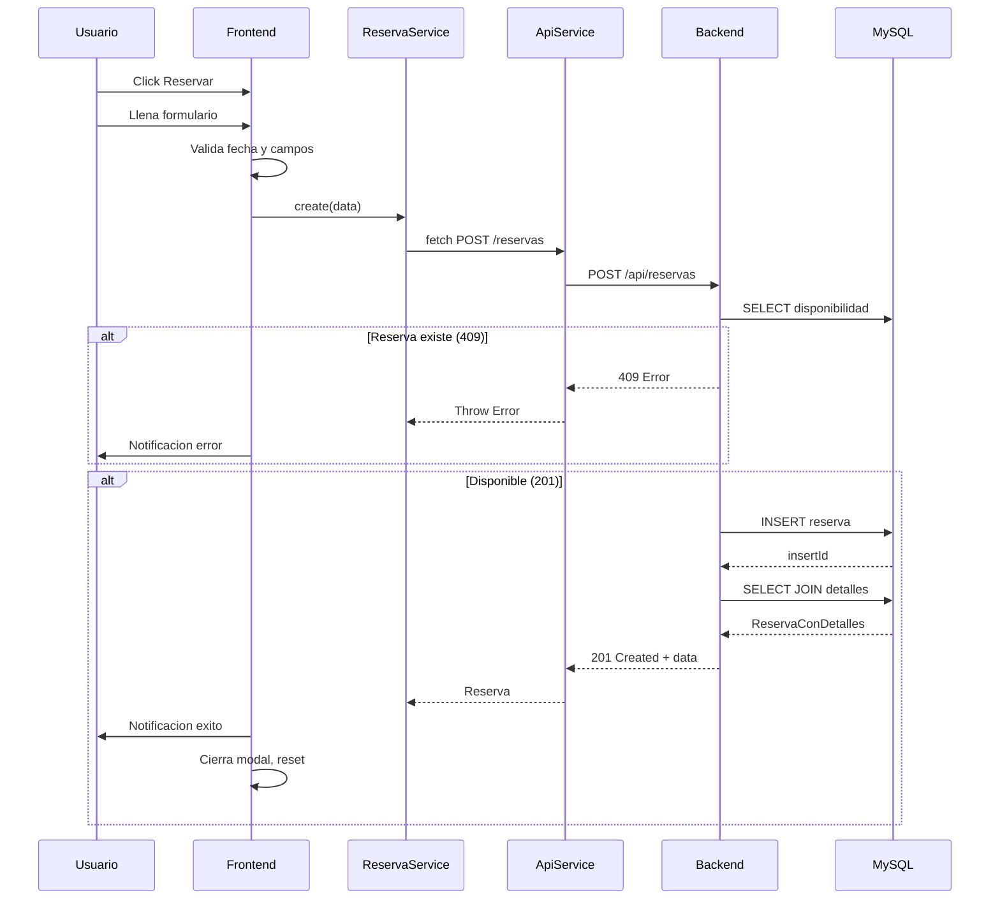
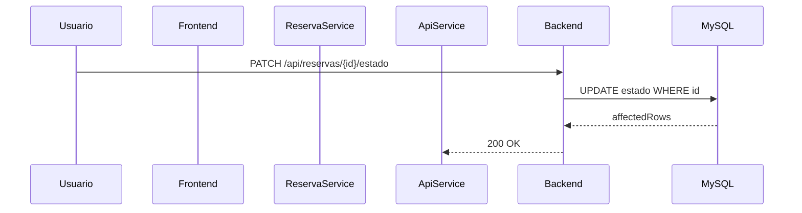

# Diagramas de Secuencia (API)

## GET /api/servicios

```mermaid
sequenceDiagram
    participant U as Usuario
    participant F as Frontend
    participant S as ServicioService
    participant A as ApiService
    participant B as Backend
    participant DB as MySQL

    U->>F: Carga pagina
    F->>F: renderState CARGANDO
    F->>S: getAll()
    S->>A: fetch('/servicios')
    A->>B: GET /api/servicios
    B->>DB: SELECT servicios WHERE activo
    DB-->>B: Rows
    B-->>A: 200 OK + data
    A-->>S: ApiResponse
    S-->>F: Servicio[]
    F->>F: renderState EXITO
    F->>U: Muestra tarjetas
```

## GET /api/reservas

```mermaid
sequenceDiagram
    participant F as Frontend
    participant RS as ReservaService
    participant A as ApiService
    participant B as Backend
    participant DB as MySQL

    F->>RS: getAll()
    RS->>A: fetch('/reservas')
    A->>B: GET /api/reservas
    B->>DB: SELECT reservas JOIN clientes/servicios/profesionales
    DB-->>B: Rows con JOIN
    B-->>A: 200 OK + data
    A-->>RS: ApiResponse
    RS-->>F: Reserva[]
    F->>F: renderReservas
```

## POST /api/reservas

```mermaid
sequenceDiagram
    participant U as Usuario
    participant F as Frontend
    participant RS as ReservaService
    participant A as ApiService
    participant B as Backend
    participant DB as MySQL

    U->>F: Click Reservar
    U->>F: Llena formulario
    F->>F: Valida fecha y campos
    F->>RS: create(data)
    RS->>A: fetch POST /reservas
    A->>B: POST /api/reservas
    B->>DB: SELECT disponibilidad
    alt Reserva existe (409)
        B-->>A: 409 Error
        A-->>RS: Throw Error
        F->>U: Notificacion error
    end
    alt Disponible (201)
        B->>DB: INSERT reserva
        DB-->>B: insertId
        B->>DB: SELECT JOIN detalles
        DB-->>B: ReservaConDetalles
        B-->>A: 201 Created + data
        A-->>RS: Reserva
        F->>U: Notificacion exito
        F->>F: Cierra modal, reset
    end
```

## PATCH /api/reservas/:id/estado

```mermaid
sequenceDiagram
    participant U as Usuario
    participant F as Frontend
    participant RS as ReservaService
    participant A as ApiService
    participant B as Backend
    participant DB as MySQL

    U->>B: PATCH /api/reservas/{id}/estado
    B->>DB: UPDATE estado WHERE id
    DB-->>B: affectedRows
    B-->>A: 200 OK
```
