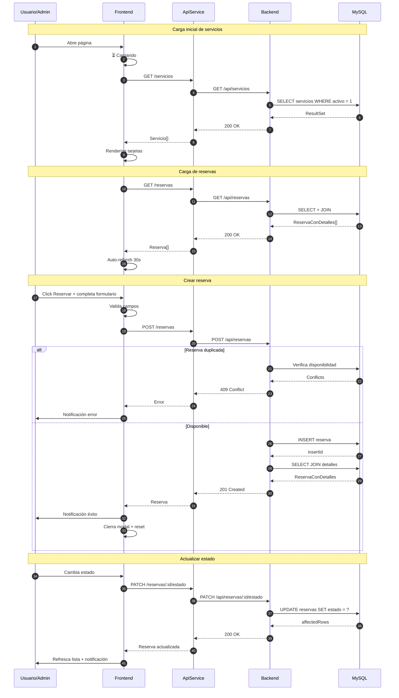

# Diagrama de Secuencia (API)

```mermaid
sequenceDiagram
    autonumber
    participant U as Usuario/Admin
    participant F as Frontend
    participant A as ApiService
    participant B as Backend
    participant DB as MySQL

    Note over U,DB: Carga inicial de servicios
    U->>F: Abre página
    F->>F: ⏳ Cargando
    F->>A: GET /servicios
    A->>B: GET /api/servicios
    B->>DB: SELECT servicios WHERE activo = 1
    DB-->>B: ResultSet
    B-->>A: 200 OK
    A-->>F: Servicio[]
    F->>F: Renderiza tarjetas

    Note over U,DB: Carga de reservas
    F->>A: GET /reservas
    A->>B: GET /api/reservas
    B->>DB: SELECT + JOIN
    DB-->>B: ReservaConDetalles[]
    B-->>A: 200 OK
    A-->>F: Reserva[]
    F->>F: Auto-refresh 30s

    Note over U,DB: Crear reserva
    U->>F: Click Reservar + completa formulario
    F->>F: Valida campos
    F->>A: POST /reservas
    A->>B: POST /api/reservas

    alt Reserva duplicada
        B->>DB: Verifica disponibilidad
        DB-->>B: Conflicto
        B-->>A: 409 Conflict
        A-->>F: Error
        F->>U: Notificación error
    else Disponible
        B->>DB: INSERT reserva
        DB-->>B: insertId
        B->>DB: SELECT JOIN detalles
        DB-->>B: ReservaConDetalles
        B-->>A: 201 Created
        A-->>F: Reserva
        F->>U: Notificación éxito
        F->>F: Cierra modal + reset
    end

    Note over U,DB: Actualizar estado
    U->>F: Cambia estado
    F->>A: PATCH /reservas/:id/estado
    A->>B: PATCH /api/reservas/:id/estado
    B->>DB: UPDATE reservas SET estado = ?
    DB-->>B: affectedRows
    B-->>A: 200 OK
    A-->>F: Reserva actualizada
    F->>U: Refresca lista + notificación
```