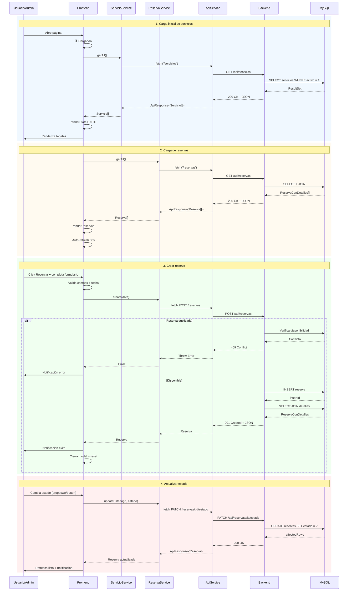

# Diagrama de Secuencia (API)

```mermaid
sequenceDiagram
    participant U as Usuario/Admin
    participant F as Frontend
    participant S as ServicioService
    participant RS as ReservaService
    participant A as ApiService
    participant B as Backend
    participant DB as MySQL

    rect rgb(240, 248, 255)
        Note over U,DB: 1. Carga inicial de servicios
        U->>F: Abre página
        F->>F: ⏳ Cargando
        F->>S: getAll()
        S->>A: fetch('/servicios')
        A->>B: GET /api/servicios
        B->>DB: SELECT servicios WHERE activo = 1
        DB-->>B: ResultSet
        B-->>A: 200 OK + JSON
        A-->>S: ApiResponse<Servicio[]>
        S-->>F: Servicio[]
        F->>F: renderState EXITO
        F->>U: Renderiza tarjetas
    end

    rect rgb(255, 250, 240)
        Note over U,DB: 2. Carga de reservas
        F->>RS: getAll()
        RS->>A: fetch('/reservas')
        A->>B: GET /api/reservas
        B->>DB: SELECT + JOIN
        DB-->>B: ReservaConDetalles[]
        B-->>A: 200 OK + JSON
        A-->>RS: ApiResponse<Reserva[]>
        RS-->>F: Reserva[]
        F->>F: renderReservas
        F->>F: Auto-refresh 30s
    end

    rect rgb(240, 255, 240)
        Note over U,DB: 3. Crear reserva
        U->>F: Click Reservar + completa formulario
        F->>F: Valida campos + fecha
        F->>RS: create(data)
        RS->>A: fetch POST /reservas
        A->>B: POST /api/reservas

        alt Reserva duplicada
            B->>DB: Verifica disponibilidad
            DB-->>B: Conflicto
            B-->>A: 409 Conflict
            A-->>RS: Throw Error
            RS-->>F: Error
            F->>U: Notificación error
        else Disponible
            B->>DB: INSERT reserva
            DB-->>B: insertId
            B->>DB: SELECT JOIN detalles
            DB-->>B: ReservaConDetalles
            B-->>A: 201 Created + JSON
            A-->>RS: Reserva
            RS-->>F: Reserva
            F->>U: Notificación éxito
            F->>F: Cierra modal + reset
        end
    end

    rect rgb(255, 240, 240)
        Note over U,DB: 4. Actualizar estado
        U->>F: Cambia estado (dropdown/button)
        F->>RS: updateEstado(id, estado)
        RS->>A: fetch PATCH /reservas/:id/estado
        A->>B: PATCH /api/reservas/:id/estado
        B->>DB: UPDATE reservas SET estado = ?
        DB-->>B: affectedRows
        B-->>A: 200 OK
        A-->>RS: ApiResponse<Reserva>
        RS-->>F: Reserva actualizada
        F->>U: Refresca lista + notificación
    end
```